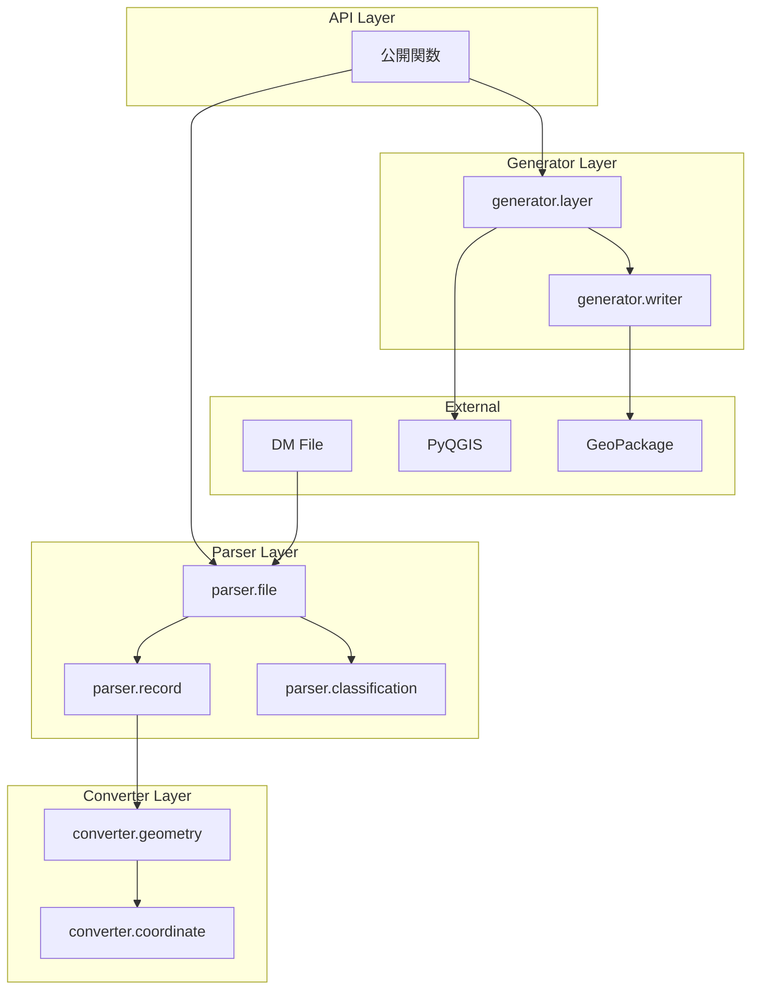
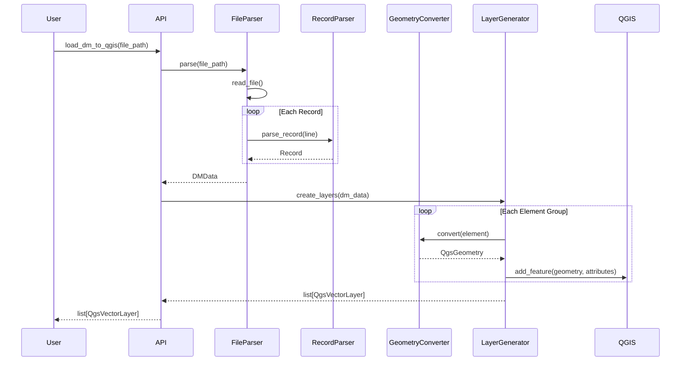
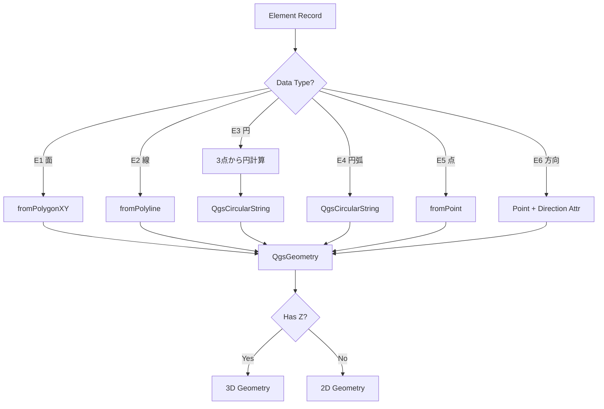
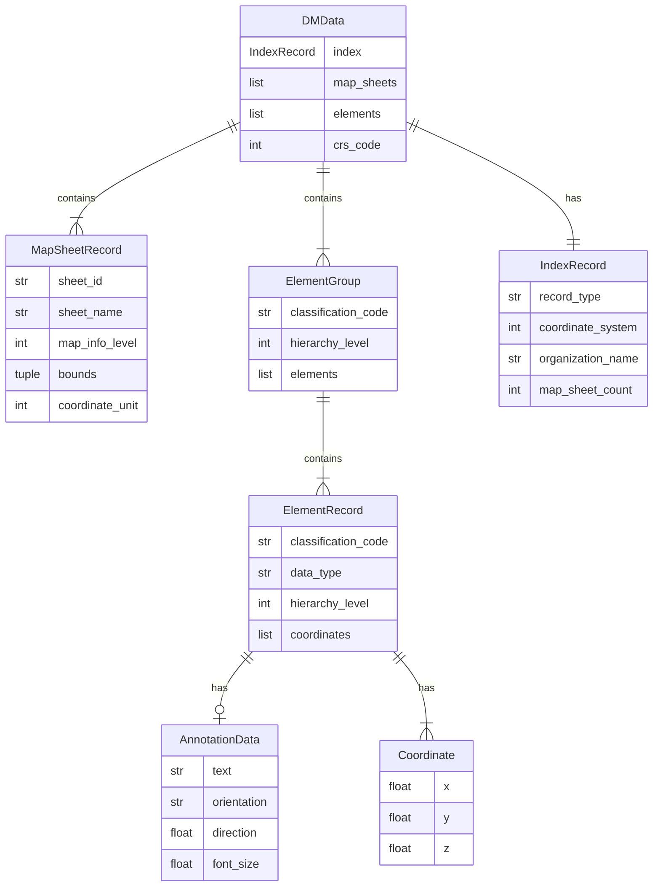

# Technical Design Document: DM Parser PyQGIS

## Overview

**Purpose**: 本モジュールは、公共測量標準図式で定義される数値地形図データファイル（DMファイル）をパースし、PyQGISのベクタレイヤに変換する機能を提供する。

**Users**: GIS技術者および開発者が、DMファイルをQGIS環境で可視化・編集・分析するために利用する。

**Impact**: DMファイルという国土地理院標準フォーマットのデータをQGISエコシステムで活用可能にし、公共測量データの利便性を向上させる。

### Goals
- DMファイル（固定長80バイトFORTRAN形式）の完全なパース機能を提供
- 各データタイプ（点・線・面・円・円弧・注記）をQGISジオメトリに正確に変換
- 分類コード・属性情報を保持したベクタレイヤを生成
- シンプルで使いやすいPython APIを提供

### Non-Goals
- TIN（不整三角網）データの処理は対象外
- DMファイルの編集・書き出し機能は対象外
- QGIS GUIプラグインとしての実装は対象外（将来検討）
- リアルタイムストリーミング処理は対象外

### Technical Notes
- **レコード長**: データ部分は80バイト固定。ファイル上は改行コード（CR+LF/LF）が付加され82〜84バイトとなる場合がある。読み込み時に改行コードを除去して処理する。
- **座標系**: DMファイルの座標値は「図郭左下座標からの相対値」として格納される。絶対座標を得るには図郭レコード(e)の左下座標を加算する必要がある。
- **修正履歴**: DMファイルには修正履歴レコードが含まれる場合がある。これらはスキップして最新データのみを処理する。

## Architecture

### Architecture Pattern & Boundary Map

本モジュールは**関数型アーキテクチャ**を採用し、純粋関数とイミュータブルデータ構造（dataclass）で構成する。Parser → Converter → Generator の3層構造で、各層は純粋関数のモジュールとして実装する。

**設計原則**:
- クラスは使用しない（dataclassはデータコンテナとしてのみ使用）
- 全ての処理は純粋関数として実装（同じ入力に対して常に同じ出力）
- 副作用（ファイルI/O、QGIS API呼び出し）は最外層のみに局所化
- 高階関数・パイプライン処理を活用



**Architecture Integration**:
- Selected pattern: レイヤードアーキテクチャ（詳細は`research.md`参照）
- Domain boundaries: Parser（ファイルI/O）、Converter（データ変換）、Generator（QGIS連携）
- New components rationale: 各層は単一責務を持ち、テスト容易性と保守性を確保

### Technology Stack

| Layer | Choice / Version | Role in Feature | Notes |
|-------|------------------|-----------------|-------|
| Language | Python 3.9+ | 実装言語 | QGIS 3.28+の要件 |
| GIS Library | PyQGIS (QGIS 3.28+) | ベクタレイヤ・ジオメトリ操作 | QgsVectorLayer, QgsGeometry等 |
| Data Format | GeoPackage | 出力フォーマット | QgsVectorFileWriter使用 |
| Type System | dataclass | データモデル定義 | 標準ライブラリ、型安全 |
| Logging | logging (stdlib) | エラー・警告出力 | QGISログシステムと統合 |

## System Flows

### DMファイル読み込みフロー



### ジオメトリ変換フロー



## Requirements Traceability

| Requirement | Summary | Components | Interfaces | Flows |
|-------------|---------|------------|------------|-------|
| 1.1 | ファイル読み込み・パース | FileParser, RecordParser | parse_dm_file() | 読み込みフロー |
| 1.2 | インデックスレコードパース | RecordParser | IndexRecord | 読み込みフロー |
| 1.3 | 図郭レコードパース | RecordParser | MapSheetRecord | 読み込みフロー |
| 1.4 | グループヘッダパース | RecordParser | GroupHeaderRecord | 読み込みフロー |
| 1.5 | 要素レコードパース | RecordParser | ElementRecord | 読み込みフロー |
| 1.6 | 座標レコードパース | RecordParser | Coordinate | 読み込みフロー |
| 1.7 | 注記レコードパース | RecordParser | AnnotationRecord | 読み込みフロー |
| 1.8 | 属性レコードパース | RecordParser | AttributeRecord | 読み込みフロー |
| 2.1 | 座標系判定 | CoordinateTransformer | get_crs() | 変換フロー |
| 2.2 | 座標単位判定 | CoordinateTransformer | normalize_coordinate() | 変換フロー |
| 2.3-2.5 | 座標値変換 | CoordinateTransformer | normalize_coordinate() | 変換フロー |
| 2.6 | Z座標処理 | GeometryConverter | convert() | 変換フロー |
| 3.1-3.7 | ジオメトリ変換 | GeometryConverter | convert() | ジオメトリ変換フロー |
| 4.1-4.8 | レイヤ生成 | LayerGenerator | create_layers() | 読み込みフロー |
| 5.1-5.4 | 分類コードマッピング | ClassificationCodeMapper | get_name() | 読み込みフロー |
| 6.1-6.6 | エラーハンドリング | 全コンポーネント | 例外クラス | 全フロー |
| 7.1-7.5 | API設計 | API Layer | 公開関数 | 全フロー |

## Components and Interfaces

| Module | Domain/Layer | Intent | Req Coverage | Key Dependencies | Contracts |
|--------|--------------|--------|--------------|------------------|-----------|
| parser.file | Parser | DMファイル読み込み・レコード分配 | 1.1 | parser.record (P0) | Functions |
| parser.record | Parser | 各レコードタイプのパース | 1.2-1.8 | - | Functions |
| parser.classification | Parser | 分類コード→名称変換 | 5.1-5.4 | - | Functions |
| converter.geometry | Converter | DMデータ→QGISジオメトリ変換 | 3.1-3.7, 2.6 | converter.coordinate (P0) | Functions |
| converter.coordinate | Converter | 座標系判定・座標値正規化 | 2.1-2.5 | - | Functions |
| generator.layer | Generator | QgsVectorLayer生成 | 4.1-4.8 | PyQGIS (P0), converter.geometry (P0) | Functions |
| generator.writer | Generator | GeoPackage出力 | 4.8 | PyQGIS (P0) | Functions |

### Parser Layer

#### parser.file モジュール

| Field | Detail |
|-------|--------|
| Intent | DMファイルを読み込み、レコードタイプに応じてパース関数に分配する |
| Requirements | 1.1 |

**Responsibilities & Constraints**
- ファイルのエンコーディング検出（Shift_JIS/UTF-8対応）
- 80バイト固定長レコードの分割（改行コード除去）
- レコードタイプ判定とパース関数呼び出し
- 修正履歴レコードのスキップ（履歴管理コードによる判定）
- パース結果の集約とDMData構築

**Dependencies**
- Outbound: parser.record — レコードパース関数 (P0)
- Outbound: parser.classification — コード変換関数 (P1)

**Contracts**: Functions [x]

##### Function Interface
```python
# parser/file.py
from dataclasses import dataclass
from pathlib import Path
from typing import Iterator

@dataclass(frozen=True)
class DMData:
    """DMファイルのパース結果（イミュータブル）"""
    index: IndexRecord
    map_sheets: tuple[MapSheetRecord, ...]
    elements: tuple[ElementGroup, ...]
    crs_code: int
    datum: GeodeticDatum

def parse_dm_file(file_path: Path | str) -> DMData:
    """
    DMファイルをパースしてDMDataを返す（純粋関数）。

    Args:
        file_path: DMファイルのパス

    Returns:
        パース結果を格納したDMData

    Raises:
        FileNotFoundError: ファイルが存在しない場合
        InvalidDMFileError: DMファイル形式でない場合
    """
    ...

def read_records(file_path: Path | str) -> Iterator[str]:
    """ファイルから80バイトレコードを順次読み出すジェネレータ。"""
    ...

def detect_encoding(file_path: Path | str) -> str:
    """ファイルのエンコーディングを検出する。"""
    ...
```

#### parser.record モジュール

| Field | Detail |
|-------|--------|
| Intent | 各レコードタイプ（インデックス・図郭・要素等）をパースする純粋関数群 |
| Requirements | 1.2-1.8 |

**Responsibilities & Constraints**
- FORTRAN形式フィールド定義に基づくフィールド抽出
- 数値変換とバリデーション
- レコードタイプ別dataclassへのマッピング
- 全関数は純粋関数（副作用なし）

**Dependencies**
- Inbound: parser.file — パース関数呼び出し (P0)

**Contracts**: Functions [x]

##### Data Types（イミュータブルデータコンテナ）
```python
# parser/record.py
from dataclasses import dataclass
from typing import Literal

@dataclass(frozen=True)
class IndexRecord:
    """インデックスレコードデータ"""
    record_type: Literal["A"]
    coordinate_system: int
    organization_name: str
    map_sheet_count: int
    classification_code_count: int
    work_standard_name: str
    version: int

@dataclass(frozen=True)
class MapSheetRecord:
    """図郭レコードデータ"""
    sheet_id: str
    sheet_name: str
    map_info_level: int
    title: str
    bounds: tuple[float, float, float, float]  # min_x, min_y, max_x, max_y
    base_coordinate: Coordinate  # 図郭左下座標（相対→絶対変換の基準）
    coordinate_unit: int  # 1=m, 10=cm, 999=mm
    survey_result_code: int  # 測地成果区分コード

@dataclass(frozen=True)
class Coordinate:
    """座標値（イミュータブル）"""
    x: float
    y: float
    z: float | None = None

@dataclass(frozen=True)
class AnnotationData:
    """注記データ"""
    text: str
    orientation: Literal["horizontal", "vertical"]
    direction: float  # degrees
    font_size: float  # 0.1mm units
    char_spacing: float  # 0.1mm units

@dataclass(frozen=True)
class ElementRecord:
    """要素レコードデータ"""
    classification_code: str
    data_type: Literal["E1", "E2", "E3", "E4", "E5", "E6", "E7", "E8"]
    hierarchy_level: int
    coordinates: tuple[Coordinate, ...]
    annotation: AnnotationData | None = None
    attributes: tuple[tuple[str, str], ...] | None = None  # イミュータブルなキーバリューペア

@dataclass(frozen=True)
class ElementGroup:
    """要素グループデータ"""
    classification_code: str
    hierarchy_level: int
    elements: tuple[ElementRecord, ...]
```

##### Pure Functions（純粋関数）
```python
# 各関数は入力に対して常に同じ出力を返す純粋関数

def parse_index_record(line: str) -> IndexRecord:
    """
    インデックスレコードをパース。

    座標系コードは図郭ID（map_sheet_id）の先頭2桁から取得する。
    例: "02JF613" → coordinate_system = 2
    """
    ...

def parse_map_sheet_records(lines: tuple[str, ...]) -> MapSheetRecord:
    """
    図郭レコード群をパース。

    測地成果区分コード（survey_result_code）はインデックスレコード(a)の
    53桁目以降の末尾数字から取得する。通常3桁で、2桁目が測地成果区分コード。
    - 0, 1: JGD2000（日本測地系2000）
    - 2: JGD2011（日本測地系2011）
    """
    ...

def parse_group_header(line: str) -> tuple[str, int, int]:
    """グループヘッダをパースして(分類コード, 階層, 要素数)を返す。"""
    ...

def parse_element_record(line: str) -> ElementRecord:
    """要素レコードをパース。"""
    ...

def parse_coordinate_records(lines: tuple[str, ...], is_3d: bool) -> tuple[Coordinate, ...]:
    """座標レコード群をパース。"""
    ...

def parse_annotation_record(line: str) -> AnnotationData:
    """注記レコードをパース。"""
    ...

def extract_field(line: str, start: int, end: int) -> str:
    """固定長レコードからフィールドを抽出するヘルパー関数。"""
    ...

def parse_int(value: str, default: int = 0) -> int:
    """文字列を整数に変換（空白・エラー時はデフォルト値）。"""
    ...

def parse_float(value: str, default: float = 0.0) -> float:
    """文字列を浮動小数点に変換（空白・エラー時はデフォルト値）。"""
    ...

def is_modification_history_record(line: str) -> bool:
    """
    修正履歴レコードか判定する純粋関数。
    履歴管理コードフィールドを確認し、過去の修正履歴であればTrueを返す。
    """
    ...

def should_skip_record(line: str) -> bool:
    """
    スキップすべきレコードか判定する純粋関数。
    修正履歴レコードや無効レコードをスキップ対象とする。
    """
    ...
```

#### parser.classification モジュール

| Field | Detail |
|-------|--------|
| Intent | 取得分類コードを人間可読な名称にマッピングする純粋関数群 |
| Requirements | 5.1-5.4 |

**Responsibilities & Constraints**
- 標準分類コード表の保持（モジュールレベル定数）
- コード→名称の変換
- 大分類グループ情報の提供
- 全関数は純粋関数（副作用なし）

**Dependencies**
- Inbound: parser.file — 名称取得 (P1)
- Inbound: generator.layer — レイヤ名生成 (P1)

**Contracts**: Functions [x]

##### Data Types & Constants
```python
# parser/classification.py
from dataclasses import dataclass
from typing import Mapping

@dataclass(frozen=True)
class ClassificationInfo:
    """分類コード情報"""
    code: str
    name: str
    category: str  # 大分類名

# 分類コードテーブル（モジュールレベル定数、イミュータブル）
CLASSIFICATION_TABLE: Mapping[str, ClassificationInfo] = {
    "21 01": ClassificationInfo("21 01", "道路縁", "交通施設"),
    "21 02": ClassificationInfo("21 02", "軽車道", "交通施設"),
    "21 03": ClassificationInfo("21 03", "徒歩道", "交通施設"),
    # ... 他の分類コード
}

# 大分類カテゴリ一覧
CATEGORIES: tuple[str, ...] = (
    "行政界", "交通施設", "建物", "小物体", "水部等",
    "土地利用等", "地形", "注記", "基準点",
)
```

##### Pure Functions
```python
def get_classification_name(code: str) -> str:
    """
    分類コードから項目名を取得する純粋関数。
    未知のコードはコードをそのまま返す。
    """
    ...

def get_classification_info(code: str) -> ClassificationInfo | None:
    """分類コードから詳細情報を取得。未知のコードはNoneを返す。"""
    ...

def get_codes_by_category(category: str) -> tuple[str, ...]:
    """大分類に属する分類コード一覧を取得。"""
    ...

def get_category(code: str) -> str | None:
    """分類コードから大分類名を取得。"""
    ...
```

### Converter Layer

#### converter.geometry モジュール

| Field | Detail |
|-------|--------|
| Intent | DMデータタイプをQGISジオメトリに変換する純粋関数群 |
| Requirements | 3.1-3.7, 2.6 |

**Responsibilities & Constraints**
- データタイプ（E1-E6）に応じたジオメトリ生成
- 3点から円の計算（E3）
- 円弧のQgsCircularString変換（E4）
- Z座標の有無に応じた2D/3D切り替え
- 全関数は純粋関数（QGISオブジェクト生成のみ、プロジェクト操作なし）

**Dependencies**
- Inbound: generator.layer — ジオメトリ変換関数呼び出し (P0)
- Outbound: converter.coordinate — 座標正規化関数 (P0)
- External: PyQGIS (QgsGeometry, QgsPoint, etc.) — ジオメトリ生成 (P0)

**Contracts**: Functions [x]

##### Pure Functions
```python
# converter/geometry.py
from qgis.core import QgsGeometry, QgsPoint, QgsPointXY

def convert_element_to_geometry(
    element: ElementRecord,
    coordinate_unit: int,
    base_coordinate: Coordinate
) -> QgsGeometry:
    """
    ElementRecordをQgsGeometryに変換する純粋関数。

    Args:
        element: 変換対象の要素レコード
        coordinate_unit: 座標単位（1=m, 10=cm, 999=mm）
        base_coordinate: 図郭左下座標（相対→絶対変換の基準）

    Returns:
        変換後のQgsGeometry（絶対座標）

    Raises:
        GeometryConversionError: 変換に失敗した場合
    """
    ...

def convert_polygon(
    coordinates: tuple[Coordinate, ...],
    unit: int,
    base_coordinate: Coordinate
) -> QgsGeometry:
    """E1(面)データをQgsPolygonに変換。座標は絶対座標に変換される。"""
    ...

def convert_line(
    coordinates: tuple[Coordinate, ...],
    unit: int,
    base_coordinate: Coordinate
) -> QgsGeometry:
    """E2(線)データをQgsLineStringに変換。座標は絶対座標に変換される。"""
    ...

def convert_circle(
    coordinates: tuple[Coordinate, ...],
    unit: int,
    base_coordinate: Coordinate
) -> QgsGeometry:
    """E3(円)データを3点外接円からQgsCircularStringに変換。座標は絶対座標に変換される。"""
    ...

def convert_arc(
    coordinates: tuple[Coordinate, ...],
    unit: int,
    base_coordinate: Coordinate
) -> QgsGeometry:
    """E4(円弧)データをQgsCircularStringに変換。座標は絶対座標に変換される。"""
    ...

def convert_point(
    coordinate: Coordinate,
    unit: int,
    base_coordinate: Coordinate
) -> QgsGeometry:
    """E5(点)データをQgsPointに変換。座標は絶対座標に変換される。"""
    ...

def calculate_circle_from_three_points(
    p1: Coordinate,
    p2: Coordinate,
    p3: Coordinate
) -> tuple[Coordinate, float]:
    """3点から外接円の中心と半径を計算する純粋関数。"""
    ...

def has_valid_z(coordinate: Coordinate, unit: int) -> bool:
    """Z座標が有効か判定する純粋関数。"""
    ...

def coordinates_to_qgs_points(
    coordinates: tuple[Coordinate, ...],
    unit: int,
    base_coordinate: Coordinate
) -> tuple[QgsPoint, ...]:
    """座標列をQgsPoint列に変換するヘルパー関数。相対座標を絶対座標に変換する。"""
    ...
```

#### converter.coordinate モジュール

| Field | Detail |
|-------|--------|
| Intent | 座標系判定と座標値の正規化を行う純粋関数群 |
| Requirements | 2.1-2.5 |

**Responsibilities & Constraints**
- 座標系コード×測地系→EPSGコード変換
- 座標単位に基づくメートル正規化
- 日本測地系対応（JGD2011: EPSG:6669-6687、JGD2000: EPSG:2443-2461）
- 全関数は純粋関数（副作用なし）

**Dependencies**
- Inbound: converter.geometry — 座標正規化関数呼び出し (P0)
- Inbound: generator.layer — CRS取得関数呼び出し (P0)

**Contracts**: Functions [x]

##### Constants（イミュータブル定数）
```python
# converter/coordinate.py
from typing import Literal, Mapping

# 測地系タイプ
GeodeticDatum = Literal["JGD2011", "JGD2000"]

# JGD2011 座標系コード → EPSGコード マッピング（イミュータブル）
JGD2011_EPSG_MAP: Mapping[int, int] = {
    1: 6669, 2: 6670, 3: 6671, 4: 6672, 5: 6673,
    6: 6674, 7: 6675, 8: 6676, 9: 6677, 10: 6678,
    11: 6679, 12: 6680, 13: 6681, 14: 6682, 15: 6683,
    16: 6684, 17: 6685, 18: 6686, 19: 6687,
}

# JGD2000 座標系コード → EPSGコード マッピング（イミュータブル）
JGD2000_EPSG_MAP: Mapping[int, int] = {
    1: 2443, 2: 2444, 3: 2445, 4: 2446, 5: 2447,
    6: 2448, 7: 2449, 8: 2450, 9: 2451, 10: 2452,
    11: 2453, 12: 2454, 13: 2455, 14: 2456, 15: 2457,
    16: 2458, 17: 2459, 18: 2460, 19: 2461,
}

# 無効なZ座標値（単位別）
INVALID_Z_VALUES: Mapping[int, float] = {
    1: -999.0,      # m単位
    10: -99900.0,   # cm単位
    999: -999000.0, # mm単位
}
```

##### Pure Functions
```python
from qgis.core import QgsCoordinateReferenceSystem

def get_geodetic_datum(survey_result_code: int) -> GeodeticDatum:
    """
    測地成果区分コードから測地系を判定する純粋関数。

    Args:
        survey_result_code: 測地成果区分コード（0,1=JGD2000, 2=JGD2011）

    Returns:
        測地系タイプ
    """
    ...

def get_epsg_code(
    coordinate_system_code: int,
    datum: GeodeticDatum
) -> int:
    """座標系コードと測地系からEPSGコードを取得する純粋関数。"""
    ...

def create_crs(epsg_code: int) -> QgsCoordinateReferenceSystem:
    """EPSGコードからQGIS CRSを生成する。"""
    ...

def get_crs(
    coordinate_system_code: int,
    datum: GeodeticDatum = "JGD2011"
) -> QgsCoordinateReferenceSystem:
    """座標系コードと測地系からQGIS CRSを取得する。"""
    ...

def normalize_coordinate(coord: Coordinate, unit: int) -> Coordinate:
    """
    座標値をメートル単位に正規化する。

    Args:
        coord: 元の座標
        unit: 単位コード（1=m, 10=cm, 999=mm）

    Returns:
        メートル単位に変換された座標
    """
    ...

def to_absolute_coordinate(
    coord: Coordinate,
    base_coord: Coordinate,
    unit: int
) -> Coordinate:
    """
    相対座標を絶対座標に変換する純粋関数。

    DMファイルの座標値は図郭左下座標からの相対値として格納される。
    この関数は相対座標に基準座標を加算し、単位変換も行う。

    Args:
        coord: 相対座標
        base_coord: 図郭左下座標（基準座標）
        unit: 単位コード（1=m, 10=cm, 999=mm）

    Returns:
        絶対座標（メートル単位）
    """
    ...

def is_valid_z(z: float | None, unit: int) -> bool:
    """Z座標が有効か判定（-999等の無効値チェック）。"""
    ...
```

### Generator Layer

#### generator.layer モジュール

| Field | Detail |
|-------|--------|
| Intent | DMDataからQgsVectorLayerを生成する関数群 |
| Requirements | 4.1-4.8 |

**Responsibilities & Constraints**
- 分類コード×ジオメトリタイプ別のレイヤ生成
- フィールド定義（分類コード・項目名・階層レベル等）
- フィーチャ追加とCRS設定
- メモリレイヤまたはGeoPackage出力
- 副作用（QGISプロジェクト操作）はこの層のみに局所化

**Dependencies**
- Inbound: 公開API — レイヤ生成関数呼び出し (P0)
- Outbound: converter.geometry — ジオメトリ変換関数 (P0)
- Outbound: converter.coordinate — CRS取得関数 (P0)
- Outbound: parser.classification — レイヤ名取得関数 (P1)
- Outbound: generator.writer — ファイル出力関数 (P1)
- External: PyQGIS — レイヤ操作 (P0)

**Contracts**: Functions [x]

##### Data Types
```python
# generator/layer.py
from dataclasses import dataclass
from pathlib import Path

@dataclass(frozen=True)
class LayerOptions:
    """レイヤ生成オプション（イミュータブル）"""
    group_by_classification: bool = True
    add_to_project: bool = True
    output_path: Path | None = None  # None=memory layer

# デフォルトオプション（モジュールレベル定数）
DEFAULT_OPTIONS: LayerOptions = LayerOptions()

# フィールド定義（イミュータブルタプル）
STANDARD_FIELDS: tuple[tuple[str, str], ...] = (
    ("dm_class_code", "string"),
    ("dm_class_name", "string"),
    ("dm_hierarchy", "integer"),
    ("dm_acquired_date", "string"),
)

ANNOTATION_FIELDS: tuple[tuple[str, str], ...] = (
    ("dm_annotation", "string"),
    ("dm_direction", "double"),
    ("dm_font_size", "double"),
    ("dm_char_spacing", "double"),
)
```

##### Functions
```python
from qgis.core import QgsVectorLayer, QgsFeature

def dm_to_layers(
    dm_data: DMData,
    options: LayerOptions = DEFAULT_OPTIONS
) -> tuple[QgsVectorLayer, ...]:
    """
    DMDataをQgsVectorLayerのタプルに変換する。

    Args:
        dm_data: パース済みDMデータ
        options: レイヤ生成オプション

    Returns:
        生成されたレイヤのタプル
    """
    ...

def create_memory_layer(
    name: str,
    geometry_type: str,
    crs: QgsCoordinateReferenceSystem,
    fields: tuple[tuple[str, str], ...]
) -> QgsVectorLayer:
    """
    メモリレイヤを作成する。

    Note: CRSはURIパラメータと明示的なsetCrs()の両方で設定し、
    QGIS環境の初期化状態に関わらず確実にCRSが設定されるようにする。
    """
    ...

def create_feature(
    geometry: QgsGeometry,
    attributes: dict[str, str | int | float]
) -> QgsFeature:
    """フィーチャを作成する純粋関数。"""
    ...

def add_features_to_layer(
    layer: QgsVectorLayer,
    features: tuple[QgsFeature, ...]
) -> int:
    """レイヤにフィーチャを追加し、追加数を返す。"""
    ...

def group_elements_by_classification_and_geometry(
    elements: tuple[ElementGroup, ...]
) -> dict[tuple[str, str], tuple[ElementRecord, ...]]:
    """要素を分類コード×ジオメトリタイプでグループ化する純粋関数。"""
    ...

def get_geometry_type(data_type: str) -> str:
    """データタイプからジオメトリタイプ文字列を取得する純粋関数。"""
    ...
```

#### generator.writer モジュール

| Field | Detail |
|-------|--------|
| Intent | ベクタレイヤをGeoPackage形式で保存する関数群 |
| Requirements | 4.8 |

**Responsibilities & Constraints**
- QgsVectorFileWriterによるGeoPackage出力
- 複数レイヤの1ファイル集約
- エラーハンドリング
- 副作用（ファイルI/O）はこの層に局所化

**Dependencies**
- Inbound: generator.layer — ファイル出力関数呼び出し (P1)
- External: PyQGIS (QgsVectorFileWriter) — ファイル書き込み (P0)

**Contracts**: Functions [x]

##### Functions
```python
# generator/writer.py
from pathlib import Path
from qgis.core import QgsVectorLayer, QgsVectorFileWriter

@dataclass(frozen=True)
class WriteResult:
    """書き込み結果（イミュータブル）"""
    success: bool
    layer_name: str
    error_message: str | None = None

def save_layer_to_geopackage(
    layer: QgsVectorLayer,
    output_path: Path,
    layer_name: str | None = None
) -> WriteResult:
    """
    単一レイヤをGeoPackageファイルに保存する。

    Args:
        layer: 保存するレイヤ
        output_path: 出力ファイルパス
        layer_name: レイヤ名（Noneの場合はlayer.name()を使用）

    Returns:
        書き込み結果
    """
    ...

def save_layers_to_geopackage(
    layers: tuple[QgsVectorLayer, ...],
    output_path: Path,
    crs_code: int | None = None
) -> tuple[WriteResult, ...]:
    """
    複数レイヤをGeoPackageファイルに保存する。

    Args:
        layers: 保存するレイヤのタプル
        output_path: 出力ファイルパス
        crs_code: EPSGコード（指定時はSQLite直接操作でCRSを確実に設定）

    Returns:
        各レイヤの書き込み結果のタプル

    Note:
        QGIS環境が完全に初期化されていない場合、CRSが正しく設定されない
        ことがある。crs_codeを指定することで、GeoPackageのSQLiteテーブル
        （gpkg_spatial_ref_sys, gpkg_geometry_columns, gpkg_contents）を
        直接更新し、CRSを確実に設定する。
    """
    ...
```

## Data Models

### Domain Model



### Logical Data Model

**構造定義**:
- `DMData`: パース結果のルートオブジェクト。イミュータブル（frozen dataclass）
- `ElementGroup`: 同一分類コード・階層レベルの要素をグループ化
- `ElementRecord`: 1つの地物要素（座標列・注記・属性を含む）
- `Coordinate`: X, Y, Z座標値（Zはオプショナル）

**インデックス**:
- `classification_code` → `ElementGroup`への高速アクセス用辞書を内部保持

### Data Contracts & Integration

**APIデータ転送**:
- 入力: ファイルパス（str | Path）
- 出力: `DMData`（パース結果）、`list[QgsVectorLayer]`（変換結果）

**属性スキーマ**:
各ベクタレイヤは以下のフィールドを持つ:

| フィールド名 | 型 | 説明 |
|-------------|------|------|
| dm_class_code | string | 取得分類コード |
| dm_class_name | string | 項目名 |
| dm_hierarchy | integer | 階層レベル |
| dm_acquired_date | string | 取得年月（YYYYMM） |
| dm_annotation | string | 注記テキスト（E7のみ） |
| dm_direction | double | 方向角度（E6, E7） |

## Error Handling

### Error Strategy

本モジュールは「Fail Fast + Graceful Degradation」戦略を採用する:
- 致命的エラー（ファイル不在、形式不正）は即時例外発生
- 軽微なエラー（不正レコード）は警告ログ出力して継続

### Error Categories and Responses

**User Errors (入力エラー)**:
- `FileNotFoundError`: ファイルパスが存在しない → パス確認を促すメッセージ
- `InvalidDMFileError`: DM形式でない → ファイル形式の確認を促す

**System Errors (変換エラー)**:
- `GeometryConversionError`: ジオメトリ変換失敗 → 該当要素をスキップ、警告ログ
- `RecordParseError`: レコードパース失敗 → 該当レコードをスキップ、警告ログ

**エラー型定義**（関数型アプローチ：例外よりResult型を優先）:
```python
# errors.py
from dataclasses import dataclass
from typing import TypeVar, Generic

T = TypeVar("T")

@dataclass(frozen=True)
class Success(Generic[T]):
    """成功結果"""
    value: T

@dataclass(frozen=True)
class Failure:
    """失敗結果"""
    error_type: str
    message: str
    context: dict[str, str] | None = None

# Result型（成功または失敗）
Result = Success[T] | Failure

# エラータイプ定数
ERROR_FILE_NOT_FOUND = "FileNotFound"
ERROR_INVALID_DM_FILE = "InvalidDMFile"
ERROR_GEOMETRY_CONVERSION = "GeometryConversion"
ERROR_RECORD_PARSE = "RecordParse"
ERROR_FILE_WRITE = "FileWrite"

# ヘルパー関数
def is_success(result: Result[T]) -> bool:
    """結果が成功かどうかを判定。"""
    return isinstance(result, Success)

def unwrap(result: Result[T]) -> T:
    """成功結果から値を取得。失敗の場合は例外を発生。"""
    if isinstance(result, Success):
        return result.value
    raise ValueError(f"{result.error_type}: {result.message}")
```

**注意**: 致命的エラー（ファイル不在等）は従来の例外も併用可能。軽微なエラー（パース警告等）はResult型でログ収集。

### Monitoring

- `logging`モジュールによる警告・エラーログ出力
- パース結果サマリー（成功数/スキップ数/エラー数）の提供
- QGISメッセージバーへの統合（オプション）

## Testing Strategy

### Unit Tests
- `test_record_parser.py`: 各レコードタイプのパース正確性
- `test_geometry_converter.py`: 各データタイプのジオメトリ変換
- `test_coordinate_transformer.py`: 座標系判定・単位変換
- `test_classification_mapper.py`: 分類コード→名称変換

### Integration Tests
- `test_file_parser.py`: DMファイル全体のパース〜DMData生成
- `test_layer_generator.py`: DMData→QgsVectorLayer変換
- `test_end_to_end.py`: ファイル読み込み→レイヤ生成の一連フロー

### Test Data
- サンプルDMファイル（小規模、各レコードタイプを含む）
- エッジケースデータ（不正レコード、境界値座標）
