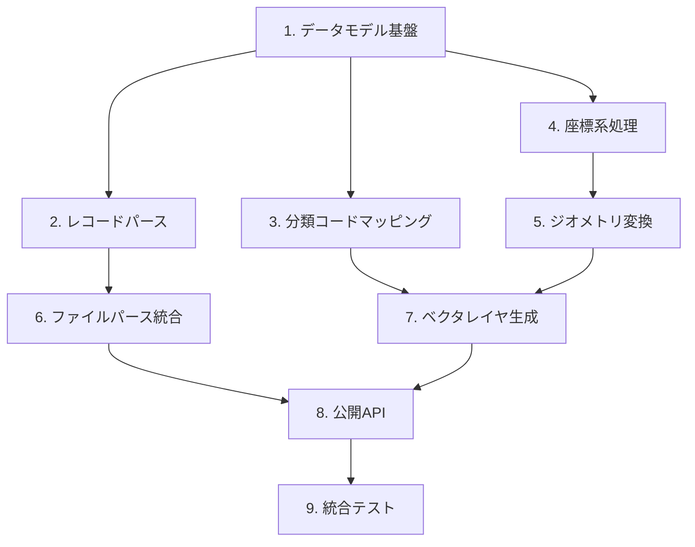

# Implementation Plan

## Task Overview

本タスクリストは、DMファイルパーサーとPyQGISベクタレイヤ変換モジュールの実装を、関数型アーキテクチャに基づいて段階的に進めるものである。

**総タスク数**: 9 メジャータスク、28 サブタスク
**要件カバレッジ**: 全7要件（44受入基準）を完全にカバー

---

## Tasks

- [ ] 1. データモデル基盤の実装
- [ ] 1.1 座標とレコードデータ型の定義
  - 座標値を表現するイミュータブルなデータ構造を作成
  - インデックスレコード、図郭レコード、要素レコードのデータ構造を定義
  - 注記データと属性データの構造を定義
  - 要素グループとパース結果全体を格納する構造を作成
  - _Requirements: 1.2, 1.3, 1.4, 1.5, 1.6, 1.7, 1.8_

- [ ] 1.2 (P) エラー型とResult型の定義
  - ファイル不在エラー、不正ファイルエラー、パースエラー、変換エラーの型を定義
  - 成功/失敗を表現するResult型を実装
  - エラー判定と値取り出しのヘルパー関数を実装
  - _Requirements: 6.1, 6.2_

- [ ] 2. レコードパース関数群の実装
- [ ] 2.1 フィールド抽出ヘルパー関数の実装
  - 固定長レコードから指定範囲の文字列を抽出する関数
  - 文字列を整数・浮動小数点に変換する関数（デフォルト値対応）
  - 修正履歴レコードの判定関数とスキップ判定関数
  - _Requirements: 1.1, 6.3, 6.5_

- [ ] 2.2 インデックスレコードパース関数の実装
  - インデックスレコード(a)(b)(c)から計画機関名・座標系・図郭情報を抽出
  - 使用分類コード一覧の抽出処理
  - _Requirements: 1.2_

- [ ] 2.3 図郭レコードパース関数の実装
  - 図郭レコード(a)〜(f)から識別番号・名称・座標範囲を抽出
  - 図郭左下座標（基準座標）の抽出
  - 測地成果区分コードと座標単位の抽出
  - _Requirements: 1.3_

- [ ] 2.4 グループヘッダと要素レコードパース関数の実装
  - レイヤヘッダ・要素グループヘッダから分類コード・階層・要素数を抽出
  - 要素レコードから分類コード・データタイプ（E1〜E8）・座標を抽出
  - _Requirements: 1.4, 1.5_

- [ ] 2.5 座標・注記・属性レコードパース関数の実装
  - 3次元座標レコード（X, Y, Z）のパース
  - 2次元座標レコード（X, Y）のパース
  - 注記レコードから縦横区分・方向・字大・字隔・テキストを抽出
  - 属性レコードからユーザー定義属性を抽出
  - _Requirements: 1.6, 1.7, 1.8_

- [ ] 3. 分類コードマッピング機能の実装
- [ ] 3.1 (P) 分類コード変換テーブルの構築
  - 取得分類コード表に基づくコード→名称マッピングテーブルを定数として定義
  - 大分類カテゴリ（行政界・交通施設・建物等）の定義
  - _Requirements: 5.1, 5.4_

- [ ] 3.2 (P) 分類コード検索関数の実装
  - コードから項目名を取得する関数（未知コードはコードをそのまま返却）
  - コードから詳細情報（名称・カテゴリ）を取得する関数
  - 大分類に属するコード一覧を取得する関数
  - _Requirements: 5.2, 5.3_

- [ ] 4. 座標系・座標値処理機能の実装
- [ ] 4.1 座標系判定とEPSGコード変換の実装
  - 測地成果区分コードからJGD2011/JGD2000を判定する関数
  - 座標系コード×測地系からEPSGコードを取得するマッピング
  - EPSGコードからQGIS CRSオブジェクトを生成する関数
  - _Requirements: 2.1_

- [ ] 4.2 座標値正規化関数の実装
  - 座標単位（m/cm/mm）に基づくメートル変換関数
  - 相対座標を絶対座標に変換する関数（図郭左下座標の加算）
  - Z座標の有効性判定関数（-999等の無効値チェック）
  - _Requirements: 2.2, 2.3, 2.4, 2.5, 2.6_

- [ ] 5. ジオメトリ変換機能の実装
- [ ] 5.1 点・線・面ジオメトリ変換関数の実装
  - E5（点）データからQgsPointジオメトリを生成
  - E2（線）データからQgsLineStringジオメトリを生成
  - E1（面）データからQgsPolygonジオメトリを生成
  - 座標列をQgsPoint列に変換するヘルパー（絶対座標変換含む）
  - _Requirements: 3.1, 3.2, 3.5_

- [ ] 5.2 円・円弧ジオメトリ変換関数の実装
  - 3点から外接円の中心・半径を計算する関数
  - E3（円）データをQgsCircularStringジオメトリに変換
  - E4（円弧）データを始点・任意点・終点からQgsCircularStringに変換
  - _Requirements: 3.3, 3.4_

- [ ] 5.3 方向・3次元ジオメトリ処理の実装
  - E6（方向）データからQgsPointと方向属性を生成
  - Z座標が有効な場合の3次元ジオメトリ生成対応
  - 要素レコード全体を統合的にジオメトリに変換するディスパッチ関数
  - _Requirements: 3.6, 3.7_

- [ ] 6. ファイルパース統合機能の実装
- [ ] 6.1 ファイル読み込みとエンコーディング検出の実装
  - ファイルのエンコーディング自動検出（Shift_JIS/UTF-8）
  - 80バイト固定長レコードの読み出しジェネレータ（改行コード除去）
  - ファイル存在確認とエラーハンドリング
  - _Requirements: 1.1, 6.1, 6.2_

- [ ] 6.2 レコード分配とDMData構築の実装
  - レコードタイプ判定と適切なパース関数への分配
  - 修正履歴レコードのスキップ処理
  - パース結果の集約と最終データ構造の構築
  - パース結果サマリー（成功数・スキップ数・エラー数）の生成
  - _Requirements: 1.1, 6.3, 6.4, 6.5, 6.6_

- [ ] 7. ベクタレイヤ生成機能の実装
- [ ] 7.1 メモリレイヤ作成関数の実装
  - ジオメトリタイプ別のQgsVectorLayerをメモリプロバイダで作成
  - 標準フィールド定義（分類コード・項目名・階層・取得年月）
  - 注記用追加フィールド定義（テキスト・方向・字大・字隔）
  - CRS設定処理
  - _Requirements: 4.2, 4.3, 4.4, 4.6, 4.7_

- [ ] 7.2 フィーチャ生成と追加処理の実装
  - ジオメトリと属性からフィーチャを作成する関数
  - 要素を分類コード×ジオメトリタイプでグループ化する関数
  - フィーチャをレイヤに一括追加する処理
  - 属性データ（E8）のユーザー定義属性付与
  - _Requirements: 4.1, 4.3, 4.5_

- [ ] 7.3 (P) GeoPackage出力機能の実装
  - 単一レイヤをGeoPackageファイルに保存する関数
  - 複数レイヤを1つのGeoPackageに集約保存する関数
  - 書き込み結果の成功/失敗判定とエラーメッセージ取得
  - _Requirements: 4.8_

- [ ] 8. 公開API関数の実装
- [ ] 8.1 パース関数とレイヤ変換関数の実装
  - DMファイルパスを受け取りDMDataを返すparse_dm_file関数
  - DMDataをベクタレイヤリストに変換するdm_to_layers関数
  - レイヤ生成オプション（グループ化・出力パス）の処理
  - _Requirements: 7.1, 7.2_

- [ ] 8.2 統合API関数とアクセサの実装
  - ファイル読み込みからレイヤ追加までを一括実行するload_dm_to_qgis関数
  - QGISプロジェクトへのレイヤ追加オプション処理
  - DMDataから図郭情報・要素データ・座標系情報へのアクセス
  - _Requirements: 7.3, 7.4_

- [ ] 9. 統合テストとバージョン互換性確認
- [ ] 9.1 パーサー統合テストの実装
  - `tests/sample_data/02JF711.dm`（小規模、約3MB）を使用した全レコードタイプのパーステスト
  - `tests/sample_data/02JF613.dm`（大規模、約7MB）を使用したスケーラビリティ確認
  - エッジケース（不正レコード・境界値座標）の処理確認
  - エラーハンドリングの動作確認
  - _Requirements: 1.1, 1.2, 1.3, 1.4, 1.5, 1.6, 1.7, 1.8, 6.1, 6.2, 6.3, 6.4, 6.5, 6.6_

- [ ] 9.2 レイヤ生成統合テストの実装
  - パース結果からベクタレイヤ生成までのエンドツーエンドテスト
  - `tests/sample_data/geojson02JF711/`のGeoJSONファイルと出力結果を照合して正確性検証
  - CRS設定（JGD2011/JGD2000）の正確性検証
  - GeoPackage出力の動作確認
  - _Requirements: 2.1, 3.1, 3.2, 3.3, 3.4, 3.5, 3.6, 3.7, 4.1, 4.2, 4.3, 4.4, 4.5, 4.6, 4.7, 4.8_

- [ ] 9.3 Python/QGIS互換性確認
  - Python 3.9以上での動作確認
  - QGIS 3.28以上での動作確認
  - 型ヒントと静的解析の整合性確認
  - _Requirements: 7.5_

---

## Requirements Coverage Matrix

| 要件 | タスク |
|------|--------|
| 1.1 | 2.1, 6.1, 6.2, 9.1 |
| 1.2 | 1.1, 2.2, 9.1 |
| 1.3 | 1.1, 2.3, 9.1 |
| 1.4 | 1.1, 2.4, 9.1 |
| 1.5 | 1.1, 2.4, 9.1 |
| 1.6 | 1.1, 2.5, 9.1 |
| 1.7 | 1.1, 2.5, 9.1 |
| 1.8 | 1.1, 2.5, 9.1 |
| 2.1 | 4.1, 9.2 |
| 2.2 | 4.2, 9.2 |
| 2.3 | 4.2 |
| 2.4 | 4.2 |
| 2.5 | 4.2 |
| 2.6 | 4.2, 9.2 |
| 3.1 | 5.1, 9.2 |
| 3.2 | 5.1, 9.2 |
| 3.3 | 5.2, 9.2 |
| 3.4 | 5.2, 9.2 |
| 3.5 | 5.1, 9.2 |
| 3.6 | 5.3, 9.2 |
| 3.7 | 5.3, 9.2 |
| 4.1 | 7.2, 9.2 |
| 4.2 | 7.1, 9.2 |
| 4.3 | 7.1, 7.2, 9.2 |
| 4.4 | 7.1, 9.2 |
| 4.5 | 7.2, 9.2 |
| 4.6 | 7.1, 9.2 |
| 4.7 | 7.1, 9.2 |
| 4.8 | 7.3, 9.2 |
| 5.1 | 3.1 |
| 5.2 | 3.2 |
| 5.3 | 3.2 |
| 5.4 | 3.1 |
| 6.1 | 1.2, 6.1, 9.1 |
| 6.2 | 1.2, 6.1, 9.1 |
| 6.3 | 2.1, 6.2, 9.1 |
| 6.4 | 6.2, 9.1 |
| 6.5 | 2.1, 6.2, 9.1 |
| 6.6 | 6.2, 9.1 |
| 7.1 | 8.1 |
| 7.2 | 8.1 |
| 7.3 | 8.2 |
| 7.4 | 8.2 |
| 7.5 | 9.3 |

---

## Task Dependencies

## Parallel Execution Notes

以下のタスクは並列実行可能（(P)マーク付き）：
- **1.2**: エラー型定義は他のデータモデルと独立
- **3.1, 3.2**: 分類コード機能はパーサー実装と並列可能
- **7.3**: GeoPackage出力はレイヤ生成と並列で実装可能

その他のタスクは依存関係があるため順次実行が必要。
