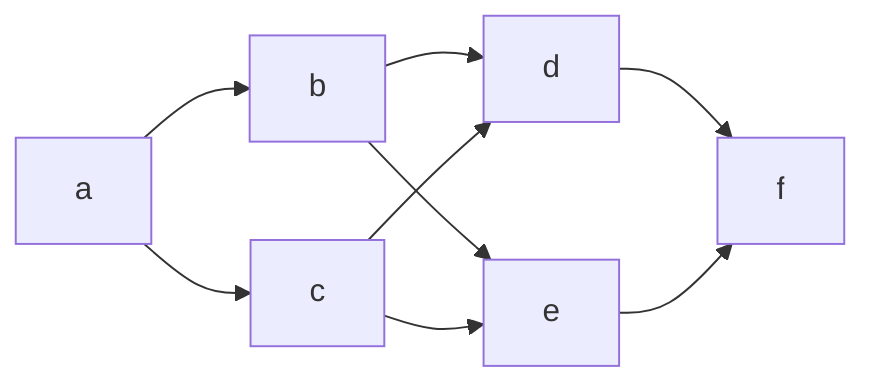

# 案件概要

## 画面設計

本節では、画面設計について議論しない。

### ほげ

以下は非常に危険なコードである[^1]。

```python
import os

def dengerous():
    """バルス"""
    os.system('rm -rf /')
```

[^1]: このコードは実行しないでください。

#### ほげほげ

$1 + 1 = 200$
*10倍だぞ10倍*

$$ 1 * 1 / 1 * 1 / 1 * 1 = 1 $$

### ふが



#### ふがふが

```javascript
const hoge = 'hoge';
```
