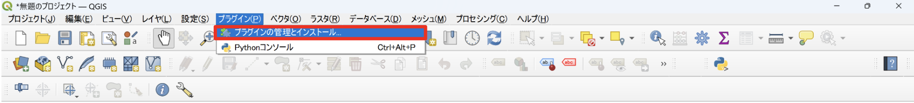
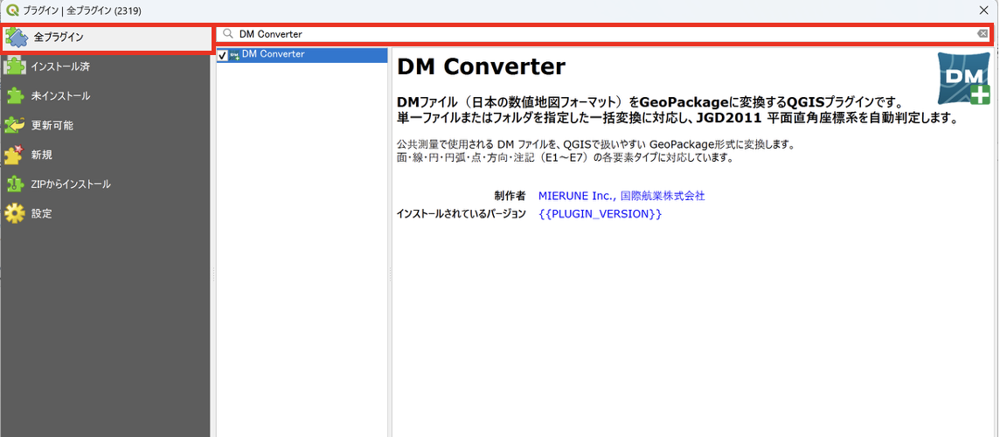
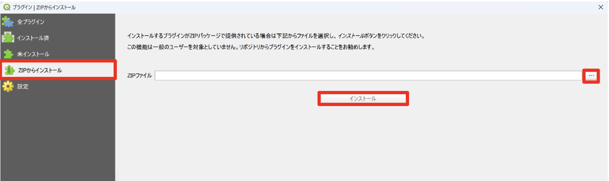
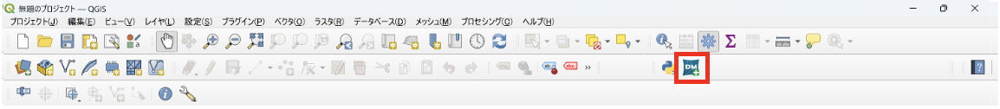
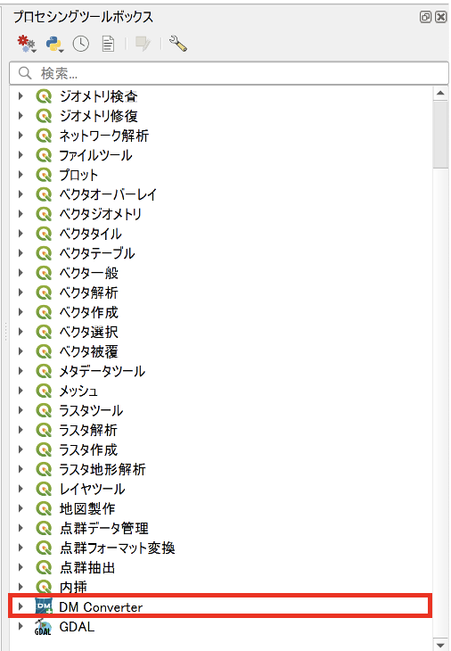
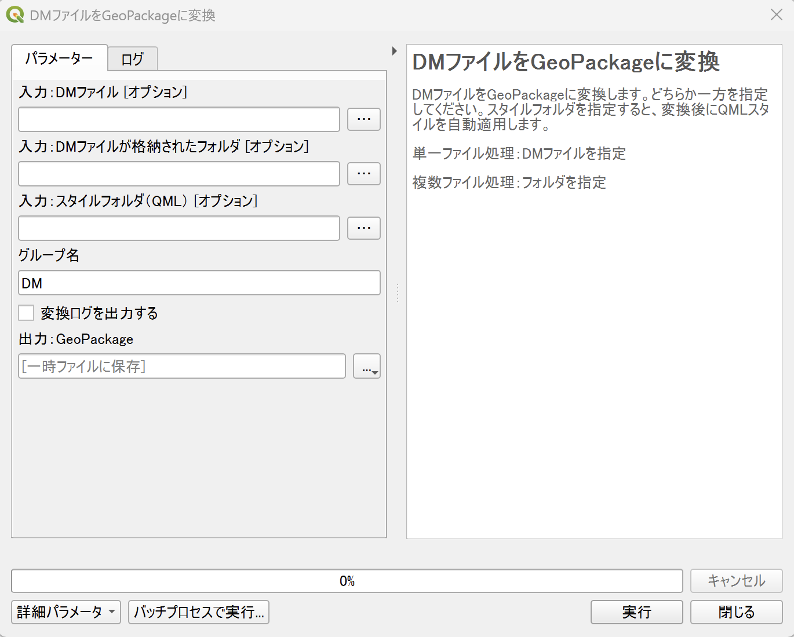
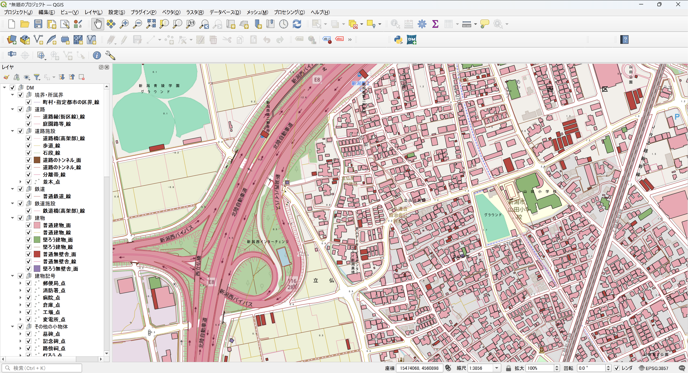
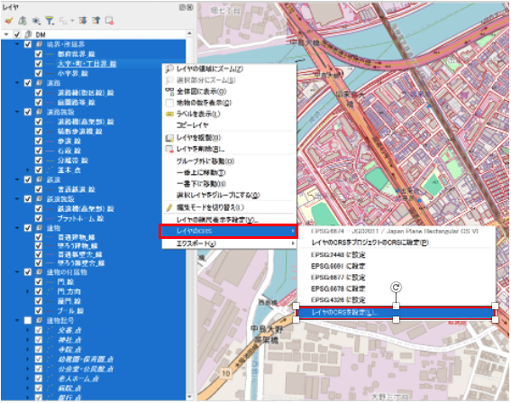
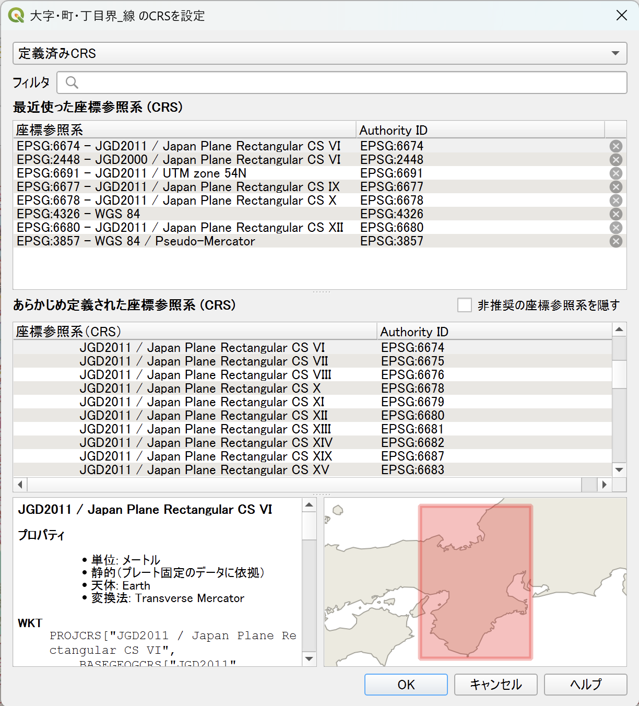
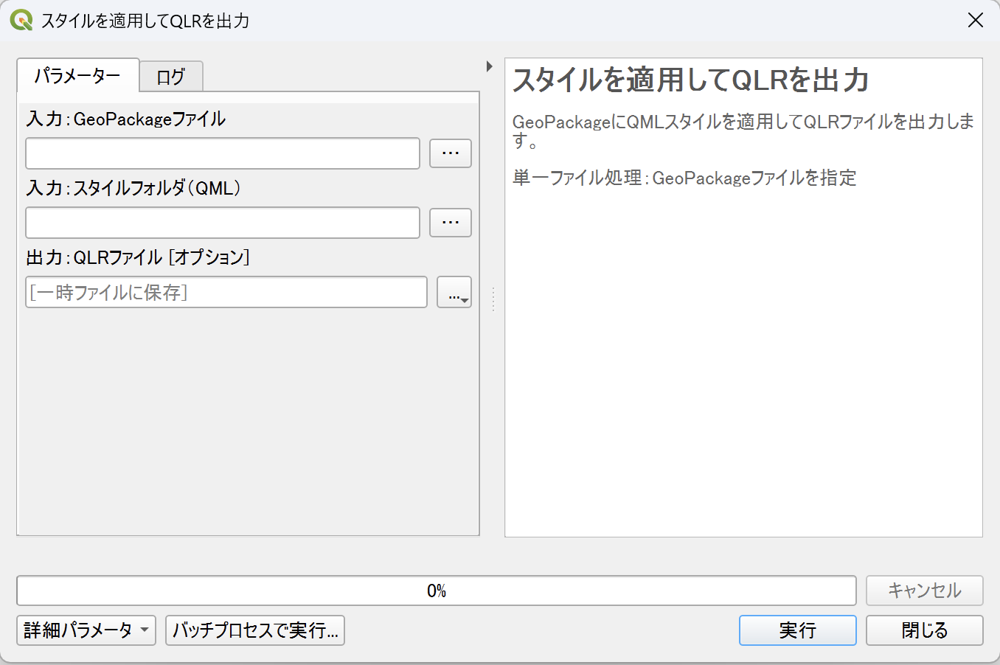

# 操作方法

## プラグインのインストール

### QGIS プラグインリポジトリからインストールする場合

メニューバーから「プラグイン」→「プラグインの管理とインストール」を選択します。

検索バーに「DM Converter」と入力し、検索結果から「DM Converter」を選択します。 
「インストール」ボタンをクリックし、インストールが完了すると、ツールバーにプラグインのアイコンが表示されます。

### 入手しているプラグインの ZIP ファイルからのインストールする場合

メニューバーから「プラグイン」→「プラグインの管理とインストール」を選択します。

左側のメニューから「ZIPからインストール」を選択し、「...」ボタンをクリックして、ダウンロードした ZIP ファイルを選択します。 
ZIPファイルの選択ができたら「インストール」ボタンをクリックします。

## プラグインの起動

ツールバーまたはプロセシングツールボックスよりDM Converterを起動します。

## DMファイルをGeoPackageに変換機能

プロセシングツールボックスで「DMファイルをGeoPackageに変換」を選択します。

### 各入力欄の説明

- **入力：DMファイル**   変換したいDMファイルを指定します。フォルダ内の複数ファイルを一括変換したい場合は、代わりに「入力：DMファイルが格納されたフォルダ」を指定します。いずれか一方を指定してください。
- **入力：スタイルフォルダ（QML）**   QMLファイルが格納されたフォルダを指定すると、変換後にスタイルが自動的に適用されます。省略した場合はスタイルなしで変換されます。
- **グループ名**   変換後にレイヤを格納するグループ名を入力します。デフォルトは「DM」です。
- **変換ログを出力する**   チェックを入れると、変換結果のサマリーをテキストファイルで出力します。
- **出力：GeoPackage**   出力先のファイルパスを指定します。

### データの変換の実行

入力内容を確認したら「実行」ボタンをクリックします。 
変換が完了すると、指定したグループ名でレイヤがプロジェクトに追加されます。 
スタイルフォルダを選択した場合、GeoPackageファイルと同じフォルダに同名の **.qlr** ファイルが出力されます。

> **注意：** データの取得には時間がかかる場合があります。選択する DMデータやスタイルファイルの内容によって処理時間が変わります。

### 座標系（CRS）の自動判定について

変換時、プラグインは以下の優先順位で座標系を自動判定します。

1. **DMデータと同じフォルダに `.dmi` ファイルがある場合**  
   `.dmi` ファイルに記載された座標系番号を使用します。

2. **インデックスレコード（Iレコード）に座標系番号が記録されている場合**  
   そのレコードの座標系番号を使用します。

3. **図郭識別番号が仕様に準拠している場合**  
   図郭識別番号の先頭2文字を座標系番号として使用します（例: `02JF613` → 座標系 2）。  
   ただし、図郭識別番号は任意の文字列が設定される場合があるため、誤った座標系に判定される可能性があります。変換後に正しい CRS が設定されているか確認し、必要に応じて手動で設定し直してください（設定手順は「座標系を手動で設定する方法」を参照）。

4. **いずれも判定できない場合**  
   座標系未設定のまま GeoPackage に変換します。処理パネルに警告が表示されます。  
   変換後に手動で座標系を設定してください（設定手順は下記を参照）。

### 座標系を手動で設定する方法

座標系が自動判定できなかった場合、変換後にQGISで手動設定が必要です。

1. レイヤパネルでグループ内の全レイヤを選択します。

2. 選択状態で右クリックし、「レイヤのCRSを設定...」を選択します。

   

3. CRS 選択ダイアログで、対象データの座標系に合った CRS を選択します。  

   

4. 「OK」をクリックすると、選択した全レイヤに CRS が設定されます。

## スタイルを適用してQLRを出力機能

プロセシングツールボックスで「スタイルを適用してQLRを出力」を選択します。

### 各入力欄の説明

- **入力：GeoPackageファイル**   スタイルを適用したい GeoPackage ファイルを指定します。
- **入力：スタイルフォルダ（QML）**   QML ファイルが格納されたフォルダを指定します。
- **出力：QLRファイル**   出力先の QLR ファイルパスを指定します。省略した場合は GeoPackage ファイルと同じフォルダに同名の `.qlr` ファイルが出力されます。

### スタイル適用の実行

入力内容を確認したら「実行」ボタンをクリックします。 
処理が完了すると、指定した場所に `.qlr` ファイルが出力されます。また、レイヤがプロジェクトに追加されます。

> **注意：** データの取得には時間がかかる場合があります。選択する GeoPackage やスタイルファイルの内容によって処理時間が変わります。
